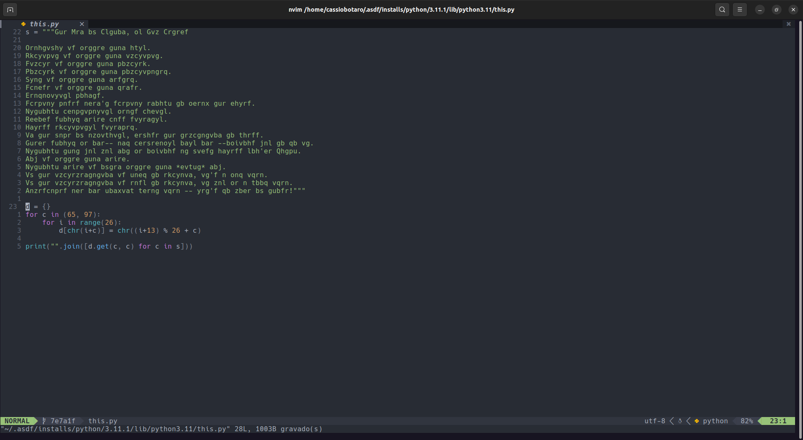

# nvim

🌙 Neovim configuration with lua.



## Install

**Prerequisites**

- Neovim 0.9+

Steps:

1. Clone the project in your config folder, usually `~/.config/nvim`:

```bash
git clone https://github.com/cassiobotaro/nvim ~/.config/nvim
```

2. Open Neovim. You should see a _"Downloading packer.."_ and then _"plugins installed"_ message in the first run
