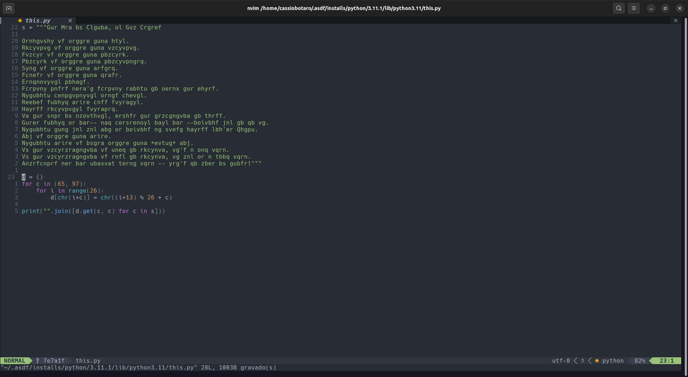

# nvim

🌙 Neovim configuration with lua.



## Install

**Prerequisites**

| Requirement | Purpose | Install |
|---|---|---|
| [Neovim 0.12+](https://github.com/neovim/neovim/releases) | Editor | See official docs |
| [git](https://git-scm.com/) | Download plugins | `apt install git` |
| [fzf](https://github.com/junegunn/fzf) | Fuzzy finder (fzf-lua) | `apt install fzf` |
| [ripgrep](https://github.com/BurntSushi/ripgrep) | Live grep search | `apt install ripgrep` |
| [Node.js](https://nodejs.org/) | LSP servers (TypeScript, YAML, JSON, Dockerfile…) | `apt install nodejs` |
| [Go](https://go.dev/) | LSP + tools for Go files (`gopls`, `goimports`) | Optional |
| [Nerd Font](https://www.nerdfonts.com/) | Icons in UI | Optional, recommended |

> `fd` is optional but speeds up file search: `apt install fd-find`

Steps:

1. Clone the project in your config folder, usually `~/.config/nvim`:

```bash
git clone https://github.com/cassiobotaro/nvim ~/.config/nvim
# or ssh
git clone git@github.com:cassiobotaro/nvim.git ~/.config/nvim
# or using cli
gh repo clone cassiobotaro/nvim ~/.config/nvim
```

2. Open Neovim. On the first run [vim.pack](https://neovim.io/doc/user/vim_pack.html) (Neovim's built-in package manager) will automatically download and install all plugins.
